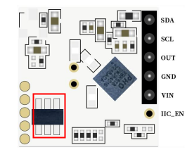
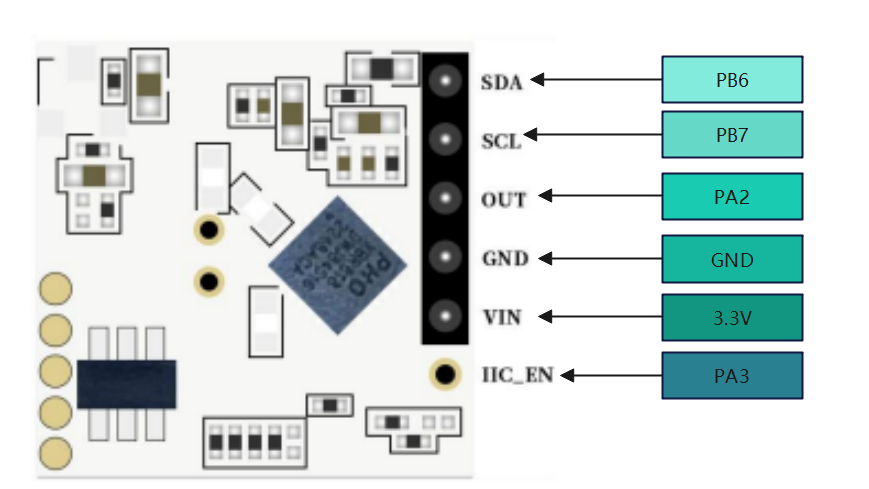

# STM32 usage routine for Rd-04

## [中文说明](README_CN.md)

## Preface

&nbsp;&nbsp;&nbsp;&nbsp;&nbsp;&nbsp;&nbsp;The latest radar module**Rd-04**from Anxinke has been released, but everyone is still confused. How should Rd-04 be used?
&nbsp;&nbsp;&nbsp;&nbsp;&nbsp;&nbsp;&nbsp;I believe everyone is quite concerned about this issue. This tutorial will provide a detailed introduction to the usage of Rd-04.

---

## 1.Rd-04 Pin Description

Rd-04 leads a total of 6pin 2.0mm row pins, with the following pins：
Serial Number| Pin Name|illustrate
-------- | -----|------
1  | SDA|IIC Data cable
2  | SCL|IIC clock line
3  |OUT|Detection result output, high level output when induced, low level output when not induced
4|GND|Power GND
5|VIN|3.3V Incoming power supply
6|IIC_EN|IIC enable, when using an external MCU to configure Rd-04 mode, this pin needs to be connected to the IO port of the external MCU to achieve low power consumption

>**Attention:**
> This article requires the use of I2C pins, so before formal wiring, the onboard MCU of Rd-04 needs to be removed. The location of the MCU is as follows:
>
> 

## 2.Wiring between Rd-04 and STM32

In this STM32 project, the wiring to Rd-04 is as follows:



## 3.STM32 Driver Migration

In order to facilitate faster implementation of functions, we have developed a driver library. You only need to write the I2C driver and it will work:

- Rd-04 I2C enables IO function, and the I2C function of Rd-04 requires IIC_ The EN pin can only be used after being pulled up, using STM32 as an example，HAL_GPIO_WritePin(GPIOA,GPIO_PIN_3,GPIO_PIN_SET)，HAL_GPIO_WritePin(GPIOA,GPIO_PIN_3,GPIO_PIN_RESET)
- I2C Send Start Signal Function
- I2C Send stop signal function
- I2C Host waiting for ACK response function
- I2C Send Byte Function
- I2C Read byte function, this function needs to come with whether to send ACK parameters to the slave
- Subtle delay function

After completing the development of the driver, replace the original one, such as:

```c
#define AXK_RD04_I2C_ENABLE HAL_GPIO_WritePin(GPIOA,GPIO_PIN_3,GPIO_PIN_SET)
#define AXK_RD04_I2C_DISABLE HAL_GPIO_WritePin(GPIOA,GPIO_PIN_3,GPIO_PIN_RESET)

#define AXK_RD04_I2C_START I2C_start()
#define AXK_RD04_I2C_STOP I2C_stop()
#define AXK_RD04_I2C_WAITACK I2C_wait_ack()
#define AXK_RD04_I2C_SEND(byte) I2C_send_byte(byte)
#define AXK_RD04_I2C_READ(ack) I2C_read_byte(ack)
#define AXK_RD04_DELAY_us(us) delay_us(us)
```

Because Rd-04 cannot output real-time detection data, only the high and low levels of IO output are available, so all we can do is to detect the 'OUT' pin output of Rd-04.
Running results:


### Other API descriptions and source code addresses

**void axk_rd04_default_config(void)**
> Rd-04 factory default configuration, the configuration parameters in it are not recommended to be modified. It is recommended to use other functions to modify the configuration

**void axk_rd04_display_config(void)**
>Output printing configuration results, requiring support for **pinrtf** printing output

**void AxkRd04SetIoValOutput(uint8_t OutputStatus)**
>Set the output level of IO VAL, which is the level that should be output when the target is detected. The default output is high

**void AxkRd04SetWayOfWorking(rd04_psm_t PSM)**
>Configure the power supply mode, which defaults to intermittent power supply, i.e. low power consumption mode

**void AxkRd04SetADCSamplingFrequency(rd04_adc_sf_t ADC_SF)**
>Configure ADC sampling frequency, default to 1KHz, available in 1KHz, 2KHz, 4KHz, and 16KHz options

**void AxkRD04SetTransmittingPower(rd04_tpower_t Tpower)**
>Configure transmission power. Default RD04_TPOWER_ 5, i.e. 0x45, with 8 options available: RD04_TPOWER_0~RD04_TPOWER_7

**void AxkRD04SetInductionThreshold(uint16_t IndTs)**
> Configure sensing threshold, default：0x15a

**void AxkRD04SetNoiseUpdate(uint16_t noiseupdate)**
>Configure update noise threshold, default：0x0155

**void AxkRD04SetInductionDelayTime(uint32_t _delay_ms)**
> Configure delay time in units：ms.default100ms

**void AxkRD04SetBlockadeTime(uint32_t _delay_ms)**
> Configure lock time, unit:：ms.default1000ms

## Summarize

**Official website：[https://www.ai-thinker.com](https://www.ai-thinker.com)**

**Develop DOCS：[https://docs.ai-thinker.com](https://docs.ai-thinker.com)**

**Forum：[http://bbs.ai-thinker.com](http://bbs.ai-thinker.com)**

**Technical support：<support@aithinker.com>**
