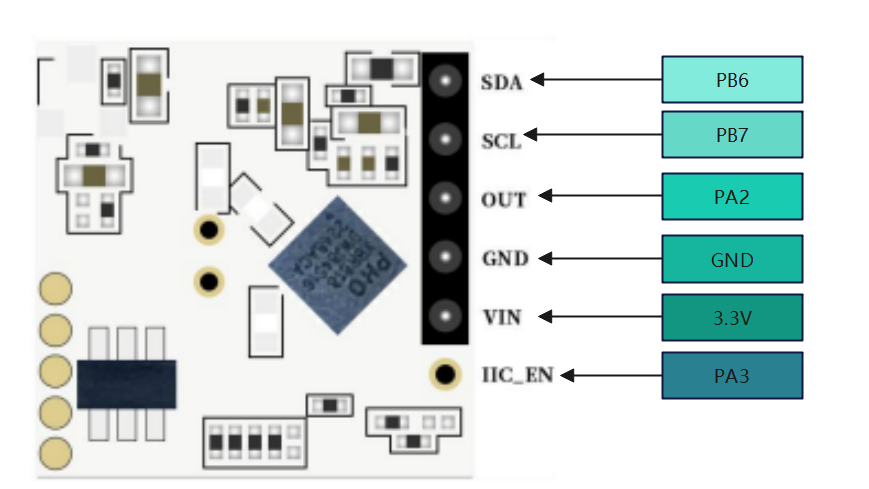

# Rd-04的STM32使用例程

## [English explanation](README.md)

# 前言

&nbsp;&nbsp;&nbsp;&nbsp;&nbsp;&nbsp;&nbsp;安信可最新雷达模组**Rd-04**已经出来了，但是大家都还是一脸懵，Rd-04该怎么用？
&nbsp;&nbsp;&nbsp;&nbsp;&nbsp;&nbsp;&nbsp;想必大家都比较关心这个问题，本教程就给大家详细介绍一下Rd-04的用法。

---

# 一、Rd-04引脚说明

Rd-04 一共引出6pin 2.0mm 的排针，引脚如下：
序号| 引脚名称|说明
-------- | -----|------
1  | SDA|IIC 数据线
2  | SCL|IIC 时钟线
3  |OUT|检测结果输出，感应时输出高电平，未感应时输出低电平
4|GND|接地
5|VIN|N 3.3V 输入电源
6|IIC_EN|IIC 使能，当使用外部 MCU 配置 Rd-04 模式时，此pin 脚要接外部MCU 的 IO 口，用于实现低功耗

>**注意：**
> 本文需要使用到I2C引脚，所以正式接线之前，需要把Rd-04的板载MCU 拆掉，MCU的位置如下：
>
> 

# 二、Rd-04与STM32的接线

在本次的STM32工程当中，与Rd-04的接线如下：



# 三、STM32驱动移植

为了方便大家更快实现功能，我们开发了一个驱动库，你只需要把I2C的驱动写好就OK：

- Rd-04 I2C使能IO函数，Rd-04的I2C功能需要把IIC_EN引脚拉高之后才能使用，以STM32为例，使能HAL_GPIO_WritePin(GPIOA,GPIO_PIN_3,GPIO_PIN_SET)，使能：HAL_GPIO_WritePin(GPIOA,GPIO_PIN_3,GPIO_PIN_RESET)
- I2C 发送起始信号函数
- I2C 发送停止信号函数
- I2C 主机等待ACK应答函数
- I2C 发送字节函数
- I2C 读取字节函数，这个函数需要自带是否给从机发送ACK 参数
- 微妙延时函数

完成驱动的开发之后，替换掉原来的，比如：

```c
#define AXK_RD04_I2C_ENABLE HAL_GPIO_WritePin(GPIOA,GPIO_PIN_3,GPIO_PIN_SET)
#define AXK_RD04_I2C_DISABLE HAL_GPIO_WritePin(GPIOA,GPIO_PIN_3,GPIO_PIN_RESET)

#define AXK_RD04_I2C_START I2C_start()
#define AXK_RD04_I2C_STOP I2C_stop()
#define AXK_RD04_I2C_WAITACK I2C_wait_ack()
#define AXK_RD04_I2C_SEND(byte) I2C_send_byte(byte)
#define AXK_RD04_I2C_READ(ack) I2C_read_byte(ack)
#define AXK_RD04_DELAY_us(us) delay_us(us)
```

因为Rd-04无法实时输出检测数据，只有IO输出的高低电平，所以，我们能做的也只能通过检测Rd-04的`OUT`引脚输出。
运行结果：


### 其他API说明及源码地址

**void axk_rd04_default_config(void)**
> Rd-04 出厂默认配置，里面的配置参数不推荐修改，建议使用其他函数修改配置

**void axk_rd04_display_config(void)**
>输出打印配置结果，需要支持`pinrtf`打印输出

**void AxkRd04SetIoValOutput(uint8_t OutputStatus)**
>设置IO VAL的输出电平，即检测到目标时应输出的电平，默认输出高

**void AxkRd04SetWayOfWorking(rd04_psm_t PSM)**
>配置供电方式，默认为间歇供电，即低功耗模式

**void AxkRd04SetADCSamplingFrequency(rd04_adc_sf_t ADC_SF)**
>配置ADC采样频率，默认1KHz,有1KHz、2KHz、4KHz和16KHz可选

**void AxkRD04SetTransmittingPower(rd04_tpower_t Tpower)**
>配置发射功率。默认 RD04_TPOWER_5，即0x45，有8档可选：RD04_TPOWER_0~RD04_TPOWER_7

**void AxkRD04SetInductionThreshold(uint16_t IndTs)**
> 配置感应门限，默认：0x15a

**void AxkRD04SetNoiseUpdate(uint16_t noiseupdate)**
>配置更新噪声门限，默认：0x0155

**void AxkRD04SetInductionDelayTime(uint32_t _delay_ms)**
> 配置延时时间，单位：ms。默认100ms

**void AxkRD04SetBlockadeTime(uint32_t _delay_ms)**
>配置锁定时间，单位：ms。默认1000ms

# 总结

**官方官网：[https://www.ai-thinker.com](https://www.ai-thinker.com)**

**开发DOCS：[https://docs.ai-thinker.com](https://docs.ai-thinker.com)**

**官方论坛：[http://bbs.ai-thinker.com](http://bbs.ai-thinker.com)**

**技术支持：<support@aithinker.com>**
